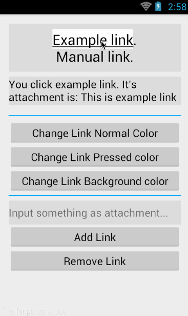

# LinkTextView

LinkTextView is an Android TextView to add highly customizable and colorful links. 

## Features
* Easy to add link and attach data.
* Set link normal color and pressed color.
* Set background normal color and pressed color.

## Sample
See the [LinkTextViewSample](https://github.com/zekunyan/LinkTextView/tree/master/LinkTextViewSample) for a common use of this library.


## How to use

Download the [LinkTextView.java](https://github.com/zekunyan/LinkTextView/blob/master/LinkTextView/LinkTextView.java) file and copy it into your project.

Add LinkTextView to your layout.
```xml
<com.zekunyan.linktextview.LinkTextView
    android:id="@+id/linkTextView"
    android:layout_width="match_parent"
    android:layout_height="80dp"
    android:background="#DDDDDD"
    android:gravity="center"
    android:textColor="#000000"
    android:textSize="24sp" />
```

Get the instance of LinkTextView.
```java
linkTextView = (LinkTextView) findViewById(R.id.linkTextView);
```

Set text.
```java
linkTextView.setClickableText("Example link.");
```

Add link with default color.
```java
int linkID = linkTextView.addClick(
        linkBegin,                          //Link begin 
        linkEnd,                            //Link end
        new LinkTextView.OnClickInLinkText() {
    @Override    
    public void onLinkTextClick(String clickText, int linkID, Object attachment) {
        infoTextView.setText("You click manual link. It's attachment is: " + attachment);
    }
}, 
    "This is attachment."                  //Link attachment
);
```

Or add link with custom color.
```java
int linkID = linkTextView.addClick(
        linkBegin,                         //Link begin
        linkEnd,                           //Link end
        new LinkTextView.OnClickInLinkText() {
    @Override
    public void onLinkTextClick(String clickText, int linkID, Object attachment) {
        infoTextView.setText("You click example link. It's attachment is: " + attachment);
    }
},
        "This is example link attachment", //Link attachment
        true,                              //Show link underline
        Color.BLACK,                       //Text normal color
        Color.YELLOW,                      //Text pressed color
        Color.WHITE,                       //Background normal color
        Color.GREEN                        //Background pressed color
);
```

You can change specific Link's color by its ID.
```java
linkTextView.setTextPressedColor(linkID, Color.RED);
```

You can remove specific link by its ID.
```java
linkTextView.removeLink(linkID);
```

## Doc


